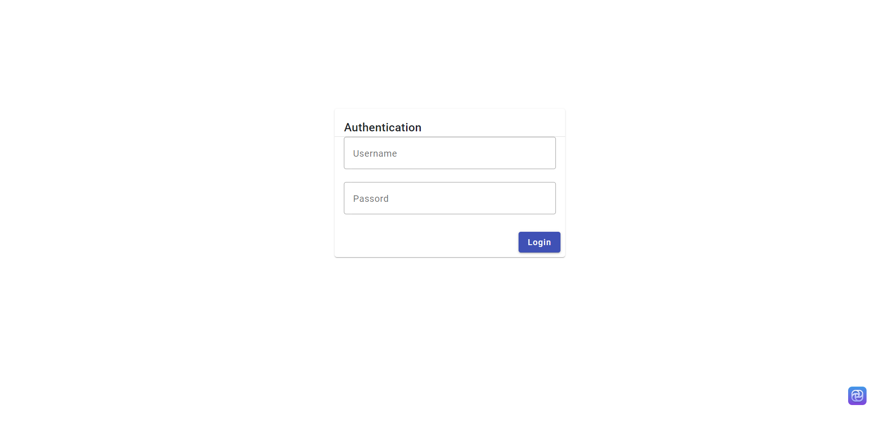

<h1>IGUIDER AMINE </h1>
<h1>Master : SDIA </h1>
<h1>Projet : Système de réservation</h1>

    back-end : Spring
    Front-end : Angular & BootStrap

<h2>Diagramme class :</h2>

<h2>DataBase :</h2>

<h2>Api Documentation avec swagger-ui :</h2>

<h2>Interfaces :</h2>
<h2>Interface Login :</h2>

<h2>Interfaces :</h2>
<h2>Interface Users :</h2>

<h2>Interface Sessions :</h2>

